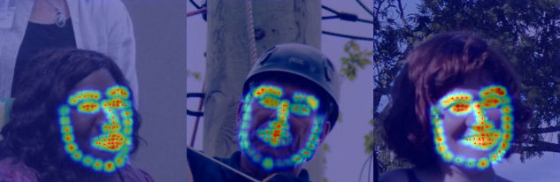

# Face Ear Landmark Detection System
Simple tf-keras code of Face Ear Landmark Detection System based on paper   
[[Realtime Multi-Person 2D Pose Estimation using Part Affinity Fields]](https://arxiv.org/abs/1611.08050).   
Jupiter notebook files a with detailed description.

### Face Landmark Detection

### Ear Landmark Detection

### Dataset (Face: 300W-LP(AFW) / Ear: ibug-ears)

  
  

### Model Architecture ([Paper](https://arxiv.org/abs/1611.08050))

This system is not for multi-person detection.    
<strong>PAF(Part Affinity Fields: Layers in Blue Area) is not included.</strong>
   
## How to test code
### Train
### Test

## Environment
* python
* tensorflow 2
## Reference
#### Paper
* [Realtime Multi-Person 2D Pose Estimation using Part Affinity Fields](https://arxiv.org/abs/1611.08050)
#### Code
* https://github.com/ZheC/Realtime_Multi-Person_Pose_Estimation
* https://github.com/mimul/chainer-pose-estimation#convert-caffe-model-to-chainer-model
#### Data
* [Facial Landmark Dataset 정리](https://ballentain.tistory.com/34)
* [Face Alignment Across Large Poses: A 3D Solution (300W-LP)](http://www.cbsr.ia.ac.cn/users/xiangyuzhu/projects/3DDFA/main.htm)
* [ibug-ears](https://ibug.doc.ic.ac.uk/resources/ibug-ears/)
