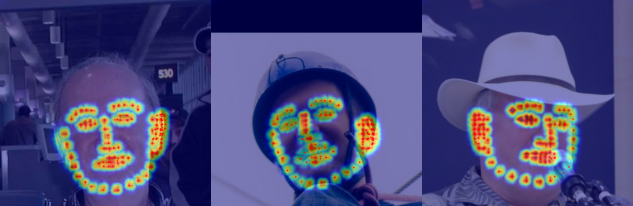

# Face Ear Landmark Detection System (with Multi-Task Learning)
tf-keras code of Face, Ear Landmark Detection System based on these papers  
아래의 논문들을 기반으로 한 얼굴, 귀 랜드마크 탐지 시스템의 tf-kears 코드
* [[Realtime Multi-Person 2D Pose Estimation using Part Affinity Fields]](https://arxiv.org/abs/1611.08050).   
* [[Distilling the Knowledge in a Neural Network]](https://arxiv.org/abs/1503.02531).  
* [[ATTENTION TRANSFER]](https://arxiv.org/abs/1612.03928).  
* [[지속적 학습 환경의 신경망 모델에서 발생하는 치명적 망각 현상의 완화]](http://www.riss.kr/search/detail/DetailView.do?p_mat_type=be54d9b8bc7cdb09&control_no=7a6323938f794ad8ffe0bdc3ef48d419&keyword=%EC%B9%98%EB%AA%85%EC%A0%81%20%EB%A7%9D%EA%B0%81%20%ED%98%84%EC%83%81%EC%9D%98%20%EC%99%84%ED%99%94).   

## Single Task Model (Face or Ear)
### Face Landmark Detection
<p align="center"></p>

### Ear Landmark Detection
<p align="center"></p>

### Model Architecture ([Paper](https://arxiv.org/abs/1611.08050))
<p align="center"></p>

This system is not for multi-person detection.    
<strong>PAF(Part Affinity Fields: Layers in Blue Area) is not included.</strong>

## Multi Task Model (Face and Ear)
We want to add the feature to detect a new task(Ear) landmark in a single task(Face) landmark detection model.   
우리는 단일 Task(Face) 랜드마크 탐지 모델에 새로운 Task(Ear)의 랜드마크를 탐지하는 기능을 추가하길 원합니다.  

<strong>1. 새로운 Task를 위한 모델을 학습해 총 2개의 모델 사용</strong>
> ❌ 동시에 2개 모델을 사용하므로 필요한 리소스가 큽니다.

<strong>2. 기존 Task 데이터와 새로운 Task 데이터를 합쳐 새로운 모델을 학습 </strong>
> ❌ 기존 모델의 학습된 정보를 이용하지 않아 비효율적입니다.   
> ❌ 학습 시간이 오래 걸립니다.

<strong>3. 기존 모델의 가중치를 고정, 새로운 Task를 위한 output layer를 만들고 학습</strong>
> ❌ 새로운 Task를 위한 가중치가 제한적이므로 성능이 떨어질 수 있습니다.

<strong>4. Knowledge Distillation 기법을 사용해 새로운 Task를 학습</strong>
> ✅ Multi Task Learning 에 효율적인 기법으로 과거 학습 지식을 유지하며 현재 학습 지식을 잘 학습할 수 있습니다.

### Model Architecture
<p align="center"></p>

Update: Knowledge Tansfer [(ATTENTION TRANSFER)](https://arxiv.org/abs/1612.03928) 기법 추가.

### Full Landmark Detection
<p align="center"></p>

### Demo
<p align="center"></p>


## Dataset (Face: 300W-LP(AFW) / Ear: ibug-ears)
<p align="center">
  
  
</p>
   
## Run
### Train
Single Task Model Train   
* Face landmark model train
```
> python train_face.py
```
* Ear landmark model train
```
> python train_ear.py
```
Multi Task Model Train <strong>(Run train_face.py first!!!)</strong>
```
> python train_face2ear.py
```
### Demo
```
> python demo_multi.py
```
## Environment
* python
* tensorflow 2
## Reference
#### Paper
* [Realtime Multi-Person 2D Pose Estimation using Part Affinity Fields](https://arxiv.org/abs/1611.08050)
* [Distilling the Knowledge in a Neural Network](https://arxiv.org/abs/1503.02531)
* [ATTENTION TRANSFER](https://arxiv.org/abs/1612.03928)
* [지속적 학습 환경의 신경망 모델에서 발생하는 치명적 망각 현상의 완화](http://www.riss.kr/search/detail/DetailView.do?p_mat_type=be54d9b8bc7cdb09&control_no=7a6323938f794ad8ffe0bdc3ef48d419&keyword=%EC%B9%98%EB%AA%85%EC%A0%81%20%EB%A7%9D%EA%B0%81%20%ED%98%84%EC%83%81%EC%9D%98%20%EC%99%84%ED%99%94)   
#### Code
* https://github.com/ZheC/Realtime_Multi-Person_Pose_Estimation
* https://github.com/mimul/chainer-pose-estimation#convert-caffe-model-to-chainer-model
* https://github.com/michalfaber/keras_Realtime_Multi-Person_Pose_Estimation/tree/0f7f5dcd8f2887a9521826dfdcf9abe56997e56a
* https://keras.io/examples/vision/knowledge_distillation/
#### Data
* [Face Alignment Across Large Poses: A 3D Solution (300W-LP)](http://www.cbsr.ia.ac.cn/users/xiangyuzhu/projects/3DDFA/main.htm)
* [ibug-ears](https://ibug.doc.ic.ac.uk/resources/ibug-ears/)
* [Facial Landmark Dataset 정리](https://ballentain.tistory.com/34)
